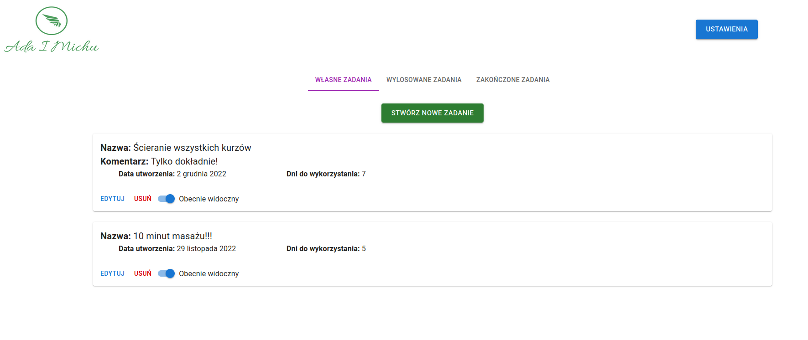
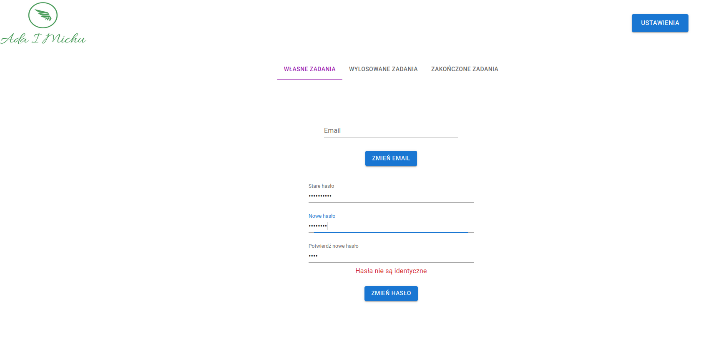
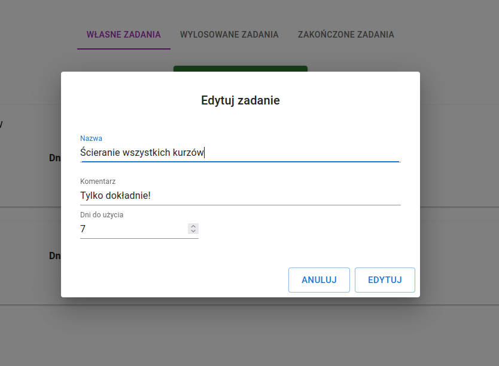
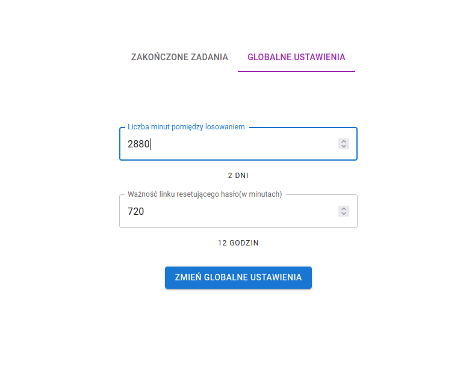
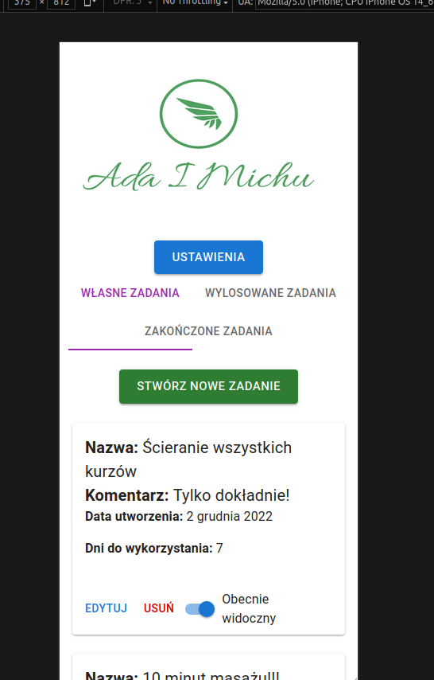

# Ada i michu
#### LIVE - https://www.adaimichu.com
#### BACKEND CODE - https://github.com/Ryniek/AdaiMichu/tree/master
#### FRONTEND CODE - https://github.com/Ryniek/Adaimichu-front/tree/master

## Table of Contents

* [Introduction](#introduction)
* [Technologies and libraries used](#technologies-and-libraries-used)
* [ERD diagram](#erd-diagram)
* [Overview](#overview)
	- [REST API](#rest-api)
  - [Deployment](#deployment)
  - [Database Migration](#database-migration)
  - [Mobile support](#mobile-support)
  - [Security and authorization](#security-and-authorization)
  - [Tests](#tests)
* [Features](#features)
* [To do](#to-do)
* [Screenshots](#screenshots)
* [Contact](#contact)

## Introduction
Application initially was created only for two people. In the future i'm going to develop it to use for more people. The main concept of the application is to have fun with the person you want to use it with. Players have possibility to create a task that can be drawn later by both of them. Drawn task can be used in a specific period of time against other player.
## Technologies and libraries used
<b>1. Backend</b>
* OpenJDK 17
* Spring Boot 2.7.4
* MySQL Database
* Maven 3.6.3

<b>2. Frontend</b>
* React 18.2.0
* React-Redux 8.0.5
* MUI 5.10.14

<b>3. Tools</b>
* Eclipse IDE
* Git
* Visual Studio Code
* Dbeaver
* Docker
* Insomnia
## ERD diagram

## Overview
#### REST API
In the application I implemented a tool(OpenAPI) that allows user to interact with the API's resources in a clear way. API is accessible at https://www.api.adaimichu.com/swagger-ui/index.html . To use most of the endpoints firstly you need to use login endpoint and pass returned token to the "Authorize" box in top-right corner of the application. To get USER role login as user/test, to get ADMIN role login as admin/test.
#### Deployment
Backend of the application is deployed on AWS Elastic Beanstalk that using Amazon RDS database instance. Frontend of the application is deployed on AWS Amplify. I created subdomain 'api' for backend which allowed to generate ssl certificate and front deployed on main domain 'adaimichu'.
#### Database migration
To track and deploy database schema changes I am using Liquibase tool. It allows me to safely making changes in code application without any unexpected data behaviours in production database.
#### Mobile support
The application can be easily run on most current mobile phones that have access to the Internet via browser. Content should be readable and should easily fit to the screen.
#### Security and authorization
Connection between user and server is secured by https protocol. Passwords are encoded and stored as a hash in database. We are not storing any sensitive data. There are two roles in the application - USER and ADMIN. After successfull login to the client returns JWT which must be added to the next request as an Authorization header. Server is responsible for checking if decoded token is valid and if user can get access to the resource.
#### Tests
For testing purposes I am using H2 Embedded Database. There are three types of tests in the application. Data layer tests, web layer tests and service layer tests. I tried to cover all cases.
#### Profiles
There are two profiles - prod and dev. "Dev" is used for developing purposes on local environment with some sample data. "Prod" profile is currently used only for desired people with untouchable data.
## Features
 - Logging into the application with predefined earlier credentials.
 - Creating and editing(self-created) tasks.
 - Drawing task from the pool of unstarted and unfinished tasks every certain period of time specified by the admin.
 - Removing or hiding unstarted, self-created tasks.
 - Possibility to change password and email address.
 - Email notifications when your opponent drawn a task or when you are able to draw a new task.
 - Password reseting using the link in the email
 - Admin panel for setting global app settings such as time between possibility to draw or password reset link expiration time.
## To do
 - Possibility to register an account and invite another player to the game via link or special panel.
 - Implementing refresh token functionality.
 - Filtering tasks.
 - Pagination.
## Screenshots
<h3 align="center">User's tasks panel</h3>

<h3 align="center">Profile panel</h3>

<h3 align="center">Task editing</h3>

<h3 align="center">Admin panel</h3>

<h3 align="center">Mobile view</h3>

## Contact
Please don’t hesitate to contact me at michalrynski96@gmail.com
